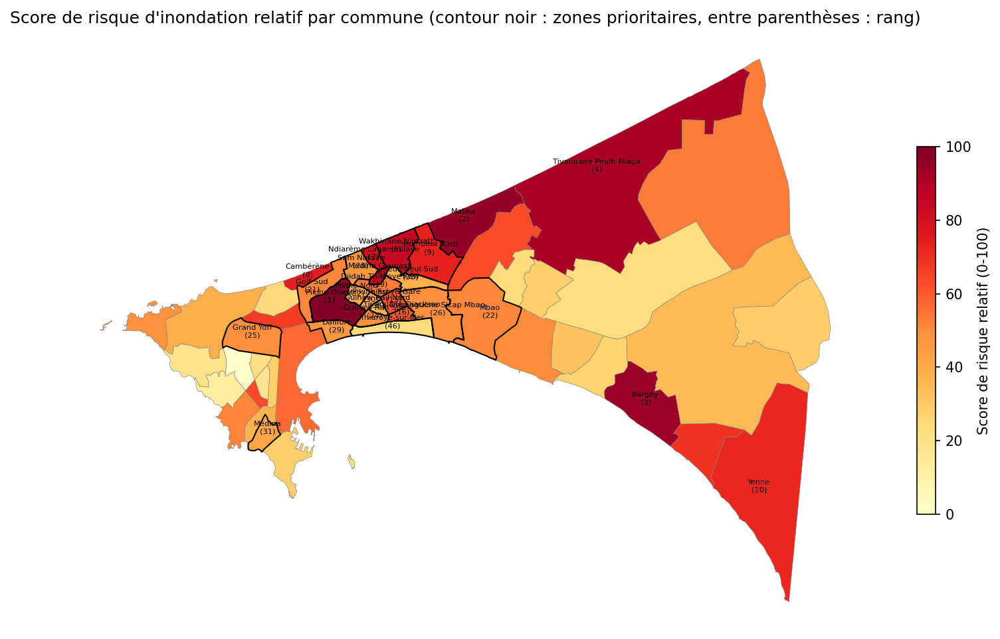

# Observatoire du risque d'inondation urbaine — Dakar

Premier chantier du projet « Dakar ville intelligente » : un **classement relatif des 53 communes d'arrondissement de la région de Dakar selon leur exposition physique aux inondations**. Il est construit à partir de données satellitaires et topographiques ouvertes, et rendu dans une appli web dont l'**IA générative explique chaque résultat et ses limites**.

Zones prioritaires de l'étude : Pikine, Guédiawaye, Médina, Yeumbeul et Grand Yoff.



> ⚠️ **À lire avant d'utiliser les résultats.** Le score est *relatif* : il compare les communes entre elles et **n'est pas une probabilité d'inondation**. Seules 13 communes sur 53 ont un classement stable quels que soient les indicateurs retenus, et le radar satellite ne voit pas l'eau en bâti dense. Toutes les limites sont détaillées [plus bas](#limites-méthodologiques).

## Ce que fait l'appli

| Fonction | Détail |
|---|---|
| **Carte 3D / 2D** | Carte pydeck où la hauteur de chaque commune est proportionnelle à son score, avec les mêmes couleurs par classe de risque que la carte Plotly 2D, disponible en option. |
| **Fiche commune** | Score (0-100), classe, rang sur 53, altitude du sol, part en cuvette, eau détectée par satellite, eau permanente et surface. |
| **Badge de confiance** | Haute, moyenne ou faible, selon la stabilité du classement et la détectabilité de l'eau par radar. Une phrase d'explication s'affiche au survol. |
| **« Expliquer ce risque » (IA)** | Explication en français et conseils pratiques générés par un modèle de langage (Groq, `openai/gpt-oss-120b`), qui mentionne obligatoirement les limites de fiabilité de la commune. |
| **Chat (IA)** | Questions libres sur la commune sélectionnée (« Pourquoi ce classement ? », « Quelles sont les limites des données ? »…). L'assistant répond uniquement à partir des données de l'observatoire et refuse poliment les questions hors sujet. |
| **Comparaison** | 2 ou 3 communes côte à côte : tableau, graphique en barres sur une échelle commune de 0 à 100, synthèse automatique et avertissements par commune. |

**Fiabilité de la partie IA.** Chaque appel à Groq est coupé au bout de **5 secondes**. En cas de dépassement, d'erreur, de clé absente ou de limite de requêtes atteinte, l'appli affiche une réponse **pré-rédigée** construite à partir des données de la commune :
- une explication et des conseils adaptés à sa classe de risque pour le bouton ;
- les données brutes pour le chat.

Elle affiche toujours quelque chose, avec ou sans IA.

## Installation et lancement de l'appli

Python 3.11 ou plus récent (testé avec Python 3.13 sous Windows).

```bash
git clone https://github.com/cdjarabe07/dakar-risque-inondation.git
cd dakar-risque-inondation
python -m pip install -r requirements.txt
python app.py
```

Ouvrir ensuite **http://127.0.0.1:7860**.

### Clé API Groq, facultative mais recommandée

La partie IA a besoin d'une clé gratuite, à créer sur https://console.groq.com/keys, placée dans la variable d'environnement **`GROQ_API_KEY`** :

```bash
# Windows (puis rouvrir le terminal)
setx GROQ_API_KEY "votre_clé"
# Linux / macOS
export GROQ_API_KEY="votre_clé"
```

- **Ne jamais écrire la clé dans le code** : elle est lue uniquement dans l'environnement.
- **Sans clé, l'appli fonctionne quand même.** Carte, fiche, badge et comparaison n'utilisent pas l'IA, et le bouton comme le chat affichent la réponse pré-rédigée.
- Le compte Groq gratuit limite le nombre de requêtes par minute. Au-delà d'une dizaine de questions en une minute, la réponse pré-rédigée prend le relais.

### Connexion internet

L'appli lit un fichier local (`data/processed/score_risque_communes.geojson`) et ne fait aucun calcul lourd. Le navigateur a toutefois besoin d'internet pour :
- les fonds de carte (2D et 3D) ;
- la bibliothèque 3D deck.gl ;
- les appels à Groq.

Hors ligne, la fiche, le badge de confiance et le tableau de comparaison ne dépendent que du fichier local.

### Tests

```bash
python tests/test_secours.py
```

Sans clé, 18 scénarios sont testés : clé absente, clé invalide, Groq trop lent (coupure à 5 s), réinitialisation du chat, carte 3D des 53 communes, bascule 2D/3D, comparaison, niveaux de confiance. Avec `GROQ_API_KEY`, le script ajoute de vrais appels : refus hors sujet, résistance aux tentatives de détournement, lecture correcte des rangs.

## Reproduire l'analyse (notebooks)

Les résultats de `data/processed/` sont versionnés : **inutile de relancer les notebooks pour utiliser l'appli**. Pour tout recalculer :

```bash
python -m pip install -r requirements-analyse.txt
python -m notebook
```

| # | Notebook | Produit | Compte requis |
|---|---|---|---|
| 00 | `notebooks/00_collecte_quartiers.ipynb` | contours des 53 communes découpés sur la terre ferme (OpenStreetMap / Overpass) | non |
| 01 | `notebooks/01_collecte_precipitations.ipynb` | pluie journalière 2023-2026 et épisodes de fortes pluies (CHIRPS) | non |
| 02 | `notebooks/02_collecte_satellite_topo.ipynb` | eau stagnante par radar Sentinel-1, altitude et cuvettes (Copernicus DEM) | **oui** : compte gratuit Copernicus Data Space et client OAuth enregistré comme profil sentinelhub `cdse` (https://shapps.dataspace.copernicus.eu/dashboard/) |
| 03 | `notebooks/03_calcul_score_risque.ipynb` | score composite, classes, contrôle de robustesse → `score_risque_communes.geojson` / `.csv` (**lus par l'appli**) | non |

`data/raw/` (environ 200 Mo d'images radar, de DEM et de réponses brutes d'Overpass) n'est pas versionné : les notebooks 00 à 02 le retéléchargent.

### Méthode en bref

1. **Unité** : les 53 communes d'arrondissement (OpenStreetMap), découpées le long du trait de côte.
2. **Trois indicateurs par commune** :
   - l'altitude médiane du sol (Copernicus DEM 30 m, bâtiments retirés par un filtre morphologique) ;
   - la part de surface en cuvette (au moins 1 m plus basse que son voisinage, dans un rayon d'environ 1 km) ;
   - le % de surface en eau stagnante détectée par radar Sentinel-1 le 22/08/2024, le 27/09/2024 et le 29/08/2025, juste après de fortes pluies. Ces images sont comparées à une référence de saison sèche (mai).
3. **Score** : moyenne à poids égaux des z-scores des trois indicateurs, ramenée sur 0-100, puis 5 classes de taille égale.
4. **Robustesse** : rang recalculé sans le satellite et avec l'altitude seule. Le classement est jugé stable si l'écart est au plus de 10 rangs.

## Structure du dépôt

```
app.py                     appli Gradio (cartes, fiche, badge, comparaison, interface IA)
explication_ia.py          appels Groq, prompts, délai de 5 s et réponses de secours
tests/test_secours.py      tests de l'appli et de l'IA
notebooks/                 analyse 00 → 03
data/processed/            résultats (dont score_risque_communes.geojson, lu par l'appli)
outputs/                   figures de contrôle
requirements.txt           dépendances de l'appli
requirements-analyse.txt   dépendances des notebooks
```

## Limites méthodologiques

### Contours (OpenStreetMap, notebook 00)
- **L'unité d'analyse est la commune d'arrondissement (53 communes, 0,2 à 70 km²), pas le quartier.** OSM n'a pas de découpage homogène plus fin pour Dakar. Un résultat à l'échelle d'une commune ne dit rien des différences entre ses quartiers.
- Les limites viennent de contributeurs OSM et ne sont pas officielles (ANSD/DTGC). Contrôle fait : ni trou ni chevauchement entre communes.
- Les limites OSM débordent en mer sur la côte nord et au sud de Rufisque (jusqu'à 76 % de la surface pour Cambérène). La partie en mer a été retirée avec le trait de côte OSM, précis à quelques dizaines de mètres.
- Les plans d'eau intérieurs (lacs, Niayes) sont conservés dans les communes. Ils sont classés en « eau permanente » (déjà sombres sur le radar en saison sèche) et ne comptent donc pas comme eau stagnante.
- Le département de Keur Massar existe depuis 2021 : Yeumbeul Nord et Sud y sont rattachées, et non plus à Pikine.

### Précipitations (CHIRPS v2.0, notebook 01)
- Résolution de 0,05°, soit environ 5,5 km : un pixel est plus grand que la plupart des communes.
- CHIRPS classe une grande partie de la presqu'île comme de la mer. **13 communes sur 53 n'ont aucun pixel valide, dont 11 communes prioritaires.** CHIRPS sert donc uniquement à **dater** les fortes pluies à l'échelle régionale, pas à comparer les communes.
- Les données de juillet à septembre 2026 sont préliminaires et seront révisées.

### Eau stagnante (Sentinel-1, notebook 02)
- Analyse de 3 dates (22/08/2024, 27/09/2024, 29/08/2025), avec un passage tous les 12 jours. On voit l'eau qui persiste 1 à 5 jours après la pluie, pas le pic.
- **Le bâti dense est quasiment invisible pour la méthode** : l'effet de double rebond entre l'eau et les façades empêche l'eau de ressortir sombre. Pikine, Thiaroye, Guinaw Rail et Médina ressortent à 0 %. **Cela ne signifie pas une absence d'inondation.** L'appli le signale par l'alerte satellite et le badge de confiance.
- L'eau détectée est de l'ordre de 0,1 à 0,3 % de la terre ferme, soit quelques hectares par commune au plus. Les écarts entre communes sont faibles et bruités.
- Une bande côtière de 100 m est exclue, à cause de l'artefact du sable mouillé et du ressac.
- Les seuils (-15 à -22 dB, baisse de 3 dB) sont standards mais n'ont pas été validés sur le terrain.

### Topographie (Copernicus DEM 30 m, notebook 02)
- C'est un modèle de **surface** (bâtiments et arbres inclus). L'altitude est surestimée en zone dense, et la pente y reflète surtout les bords des toits.
- La précision verticale est d'environ 2 m : des écarts de 1 à 2 m entre communes ne sont pas significatifs.
- Le sol est approché par une ouverture morphologique de 150 m, qui retire les bâtiments. Les indicateurs « altitude » et « cuvettes » sont calculés sur ce sol approché.

### Score composite (notebook 03)
- Le score est **relatif** : il classe les 53 communes entre elles et n'exprime pas une probabilité. Il combine, à poids égaux, les z-scores de l'altitude basse, des cuvettes et de l'eau Sentinel-1.
- **CHIRPS et la pente sont exclus volontairement** (données manquantes pour la pluie, bâti pour la pente).
- **Robustesse limitée** : seules 13 communes sur 53 gardent un rang stable (écart d'au plus 10 rangs) entre le score complet, le score sans Sentinel-1 et l'altitude seule. Le haut du classement (Pikine Ouest, Malika, Keur Massar Nord) et le bas (plateau Sicap, Mermoz, Ouakam) sont stables. Le milieu dépend des choix de méthode.
- Il manque des facteurs majeurs : drainage, nappe phréatique affleurante, imperméabilisation, population. Le score mesure l'**aléa physique**, pas la vulnérabilité des habitants, et n'a pas été validé avec des inondations observées.

### IA générative
- Le modèle ne reçoit que les données de l'observatoire, et son interprétation de chaque indicateur (« fait monter / baisser le risque ») est calculée à l'avance, pour éviter les contresens. Il peut néanmoins formuler une réponse imparfaite : **les chiffres de la fiche font foi**.
- Les conseils pratiques sont génériques (gestes des ménages, actions communales). Ils ne remplacent pas les consignes officielles (ANACIM, protection civile).

## Sources des données

OpenStreetMap (contributeurs OSM, ODbL) · Copernicus Sentinel-1 et Copernicus DEM GLO-30 (ESA / Union européenne, via Copernicus Data Space Ecosystem) · CHIRPS v2.0 (Climate Hazards Center, UC Santa Barbara) · fonds de carte © CARTO.
